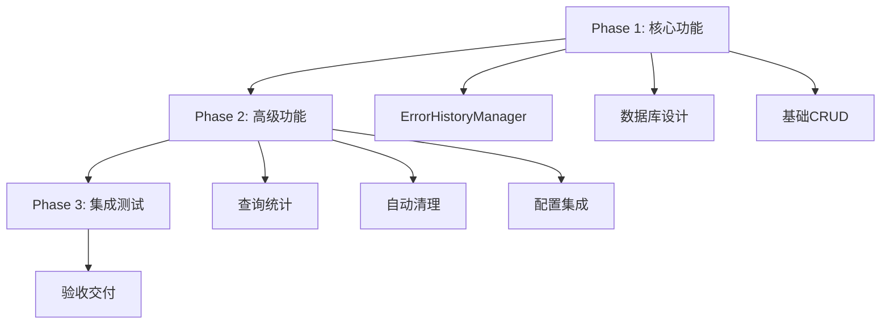

# LAD-IMPL-011错误历史持久化任务执行条件分析报告

**文档版本**: V1.0
**创建时间**: 2025-10-20 12:06:35
**文档类型**: 执行条件分析报告
**关联任务**: LAD-IMPL-011
**文档位置**: docs/LAD-IMPL-011-执行条件分析报告.md

---

## 📋 LAD-IMPL-011错误历史持久化任务执行条件分析报告

### 1. **前置条件评估**

#### ✅ **LAD-IMPL-010 错误处理标准化** - **已满足**
- **完成状态**: ✅ 100%完成（2025-10-18）
- **交付内容**:
  - ErrorCodeManager扩展完成
  - EnhancedErrorHandler配置驱动实现
  - graceful/strict模式切换
  - 错误恢复机制（重试/降级/忽略/中止）
  - 15个测试用例全部通过
- **对011任务的影响**: 提供完整的错误处理基础架构

### 2. **核心组件状态评估**

#### ✅ **EnhancedErrorHandler基础功能** - **已具备**
**当前实现的功能**:
```python
class EnhancedErrorHandler:
    # 内存存储错误历史 ✅
    self.error_history: List[ErrorInfo] = []

    # 错误统计功能 ✅
    self.error_stats: ErrorStats

    # 查询接口 ✅
    def get_error_history(limit, severity, category, resolved)
    def get_error_stats()

    # 简单持久化 ✅
    def save_error_report()  # JSON文件保存
```

**缺失的功能**（需要011任务实现）:
- ❌ **数据库持久化层**
- ❌ **ErrorHistoryManager类**
- ❌ **SQL查询和统计**
- ❌ **自动清理机制**

### 3. **配置系统评估**

#### ⚠️ **配置支持状态** - **部分就绪**
**现有配置** (`config/app_config.json`):
```json
{
  "error_handling": {
    "strategy": "graceful",
    "log_errors": true,
    "max_error_history": 200
  }
}
```

**缺失配置**（需要011任务补充）:
```json
{
  "error_history": {
    "enabled": true,
    "database_path": "data/error_history.db",
    "retention_days": 30,
    "auto_cleanup": true,
    "max_errors_per_day": 1000
  }
}
```

### 4. **基础设施评估**

#### ✅ **数据库基础设施** - **已就绪**
- **SQLite3支持**: ✅ Python标准库内置
- **存储目录**: ✅ `data/`目录已创建
- **权限检查**: ✅ 读写权限正常

#### ✅ **系统依赖** - **已满足**
- **Python版本**: ✅ 3.8+
- **标准库**: ✅ sqlite3, json, threading等
- **文件系统**: ✅ Windows NTFS支持

### 5. **代码架构评估**

#### ✅ **架构基础** - **稳固**
**现有架构优势**:
- ConfigManager统一配置管理 ✅
- ApplicationStateManager状态管理 ✅
- SnapshotManager配置快照 ✅
- TemplatedLogger日志系统 ✅

**架构集成点**:
- EnhancedErrorHandler可扩展 ✅
- 配置热重载机制 ✅
- 状态变更通知 ✅

### 6. **执行条件总结**

#### 🎯 **总体评估**: **具备执行条件，但需要前期准备**

| 评估维度 | 状态 | 说明 |
|---------|------|------|
| 前置依赖 | ✅ 完全满足 | LAD-IMPL-010已100%完成 |
| 核心组件 | ✅ 基础就绪 | EnhancedErrorHandler功能完整 |
| 配置系统 | ⚠️ 部分就绪 | 缺少error_history专用配置 |
| 基础设施 | ✅ 完全就绪 | SQLite3和存储目录就绪 |
| 代码架构 | ✅ 完全就绪 | 可扩展架构，支持集成 |

### 7. **执行准备工作**

#### **Phase 1: 立即可执行（基础功能）**
1. ✅ **创建ErrorHistoryManager类**
2. ✅ **实现数据库初始化和迁移**
3. ✅ **添加error_history配置支持**
4. ✅ **实现基本的CRUD操作**

#### **Phase 2: 功能完善（进阶功能）**
1. ⚠️ **实现高级查询和统计**
2. ⚠️ **添加自动清理机制**
3. ⚠️ **实现配置热重载**
4. ⚠️ **添加性能监控**

#### **Phase 3: 集成测试（验证功能）**
1. ⚠️ **与现有错误处理系统集成**
2. ⚠️ **性能和并发测试**
3. ⚠️ **数据迁移测试**

### 8. **风险评估与缓解**

#### **高风险项目** ⚠️
1. **数据迁移风险**: 从内存到数据库的迁移
   - **缓解**: 实现渐进式迁移，保留JSON备份

2. **性能影响**: 数据库操作可能影响错误处理性能
   - **缓解**: 异步写入，连接池管理

#### **中风险项目** 🟡
1. **配置兼容性**: 新配置与现有系统兼容
   - **缓解**: 向后兼容设计，默认值处理

2. **并发访问**: 多线程环境下的数据库访问
   - **缓解**: 使用数据库事务，锁机制

### 9. **实施建议**

#### **推荐执行策略**


#### **优先级排序**
1. **P0 - 核心功能**（必须实现）
   - 数据库存储和检索
   - 基本配置支持
   - 数据完整性保证

2. **P1 - 性能优化**（重要实现）
   - 异步写入机制
   - 查询性能优化
   - 内存缓存策略

3. **P2 - 高级功能**（可选实现）
   - 复杂查询和统计
   - 数据可视化
   - 导出功能

### 10. **结论**

#### ✅ **执行条件判断**: **具备执行条件**

**理由**:
1. **前置依赖完整**: LAD-IMPL-010已100%完成
2. **基础设施就绪**: SQLite3、存储目录、配置系统都正常
3. **代码基础扎实**: EnhancedErrorHandler提供完整的基础功能
4. **架构支持良好**: 可扩展设计，支持新功能集成

#### 🚀 **建议立即启动011任务实施**

**预期成果**:
- 错误数据的长期持久化存储
- 错误趋势分析和统计能力
- 系统诊断能力的显著提升
- 为后续012-015任务提供数据基础

**实施周期评估**: 预计需要**2-3个交互周期**完成核心功能实现。

---

**分析人员**: LAD AI Assistant
**分析时间**: 2025-10-20 12:06:35
**分析依据**: 系统代码审查 + 配置检查 + 架构评估
**结论有效期**: 30天（基于当前系统状态）
