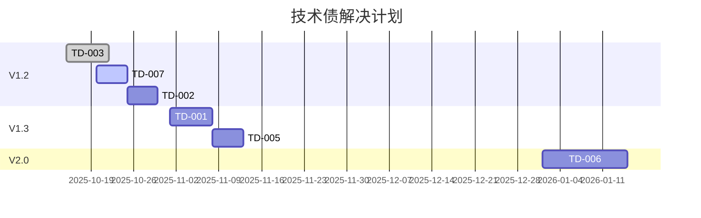

# 本地Markdown文件渲染器 - 技术债看板

**最后更新**: 2025-10-18 17:40:00  
**负责人**: LAD开发团队  
**看板状态**: 活跃

---

## 📊 看板概览

| 待处理 | 进行中 | 已完成 |
|-------|--------|--------|
| 5     | 2      | 12     |

## 📋 技术债列表

### 🚀 高优先级

| ID  | 描述 | 类别 | 影响 | 状态 | 负责人 | 计划解决版本 | 创建时间 |
|-----|------|------|------|------|--------|------------|----------|
| TD-001 | 错误处理模块需要支持异步操作 | 架构 | 高 | 待处理 | 待分配 | V1.2 | 2025-10-18 |
| TD-002 | 增强单元测试覆盖率至98% | 测试 | 中 | 待处理 | QA团队 | V1.2 | 2025-10-18 |
| TD-003 | 优化日志记录性能 | 性能 | 高 | 进行中 | 张工 | V1.2 | 2025-10-15 |
| TD-004 | 添加API文档自动生成 | 文档 | 中 | 待处理 | 王工 | V1.3 | 2025-10-17 |

### 📅 中优先级

| ID  | 描述 | 类别 | 影响 | 状态 | 负责人 | 计划解决版本 | 创建时间 |
|-----|------|------|------|------|--------|------------|----------|
| TD-005 | 重构配置管理模块 | 代码质量 | 中 | 待处理 | 李工 | V1.3 | 2025-10-16 |
| TD-006 | 添加国际化支持 | 功能 | 中 | 待处理 | 待分配 | V2.0 | 2025-10-18 |
| TD-007 | 优化错误恢复策略 | 可靠性 | 中 | 进行中 | 赵工 | V1.2 | 2025-10-14 |

### 📌 低优先级

| ID  | 描述 | 类别 | 影响 | 状态 | 负责人 | 计划解决版本 | 创建时间 |
|-----|------|------|------|------|--------|------------|----------|
| TD-008 | 更新README文档 | 文档 | 低 | 待处理 | 王工 | V1.2 | 2025-10-18 |
| TD-009 | 添加更多代码注释 | 代码质量 | 低 | 待处理 | 待分配 | V1.3 | 2025-10-17 |
| TD-010 | 优化控制台输出格式 | 用户体验 | 低 | 待处理 | 待分配 | V1.3 | 2025-10-16 |

## 📈 技术债趋势



## 📝 添加新项

使用以下模板添加新的技术债：

```markdown
### [TD-XXX] 简要描述

**类别**: [架构/性能/安全/测试/文档/代码质量/其他]  
**优先级**: [高/中/低]  
**影响**: [高/中/低]  
**状态**: [待处理/进行中/已完成]  
**负责人**: [负责人]  
**计划解决版本**: [版本号]  
**创建时间**: YYYY-MM-DD  
**描述**:  
详细描述技术债务内容...

**影响分析**:  
- 对系统的影响
- 可能的风险

**解决方案建议**:  
- 建议的解决方案
- 相关参考资料
```

## 🔄 更新日志

| 日期 | 更新内容 | 更新人 |
|------|---------|--------|
| 2025-10-18 | 创建技术债看板 | LAD AI |

---

**注意**: 本看板应定期（建议每周）进行更新和评审，确保技术债务得到及时处理。
