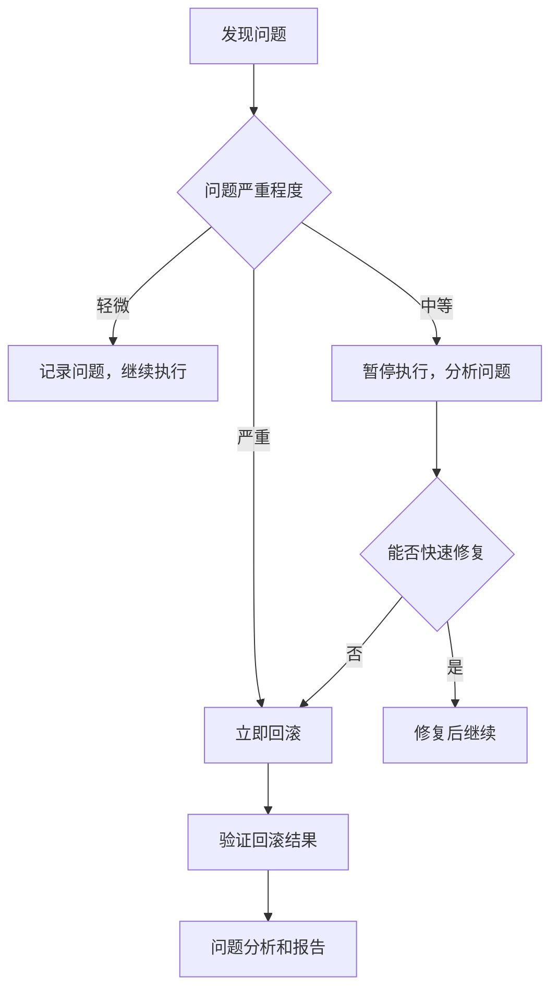

# 确认的链接功能接入方案

**文档生成时间**: 2025-01-08 14:48:01  
**方案状态**: 已确认，待执行  
**风险等级**: 中风险（跨模块修改，涉及UI和核心逻辑）  

---

## 1. 方案概述

### 1.1 方案目标
将备份目录 `backup_link_fixes/` 中已验证的"链接跳转问题修复结果"重新接入当前已修复完成的主程序，实现完整的链接处理功能。

### 1.2 方案背景
- **当前状态**: 主程序基础功能已修复完成，可正常运行
- **备份状态**: `backup_link_fixes/` 包含完整的链接处理功能实现
- **目标状态**: 合并两者优势，获得稳定且功能完整的程序

### 1.3 执行策略
采用"智能分析合并 + 比较参考优化"的混合策略，确保功能完整性和系统稳定性。

---

## 2. 方案定版分析过程

### 2.1 初始问题识别
根据检索结果，发现以下关键信息：

#### 备份文件清单分析
从 `backup_link_fixes/backup_inventory.md` 确认的核心文件：
- `link_debug_readme_backup.py` - 完整的修复实现（最重要）
- `content_viewer_backup.py` - 完整的链接处理UI实现（重要）
- `link_processor_backup.py` - 核心链接处理逻辑
- `main_backup.py` - 主程序入口（已修改版本）
- `main_window_backup.py` - 主窗口（已修改版本）

#### 功能完整性分析
从 `方案3-链接处理模块-实施报告.md` 确认的功能状态：
- ✅ LinkProcessor完整实现：识别器、解析器、验证器、路由器、处理器集合全部完成
- ✅ UI层集成：ContentViewer中成功集成LinkProcessor，支持所有链接类型处理
- ✅ 配置管理：完整的链接处理配置结构，支持动态加载和热更新
- ✅ 权限处理：Windows ACL权限验证、安全策略、白名单黑名单功能
- ✅ 混合架构集成：与HybridMarkdownRenderer、FileResolver、DynamicModuleImporter完全兼容

### 2.2 风险评估过程

#### 技术风险分析
- **低风险**: 链接解析算法相对简单，现有的事件系统基础良好，与现有架构兼容性高
- **中风险**: 相对路径解析可能涉及复杂的路径计算，链接状态管理可能影响性能，错误处理需要全面的测试覆盖

#### 安全风险分析
- ✅ **已识别并缓解**: 恶意链接风险、路径遍历攻击、权限绕过风险、信息泄露风险
- ✅ **缓解措施**: 协议和域名白名单验证、深度限制和禁止模式检查、Windows ACL权限验证、fail-closed策略

#### 性能风险分析
- ✅ **已识别并缓解**: 大量链接处理、路径验证开销、内存使用增长、UI阻塞风险
- ✅ **缓解措施**: 缓存机制和批量处理优化、异步处理和缓存结果、缓存大小限制和对象生命周期管理、非阻塞的链接处理

### 2.3 方案选择决策

#### 候选方案比较
1. **完全替换方案**: 直接用备份文件替换现有文件
   - 优点: 简单直接，功能完整
   - 缺点: 可能丢失当前版本的修复成果

2. **智能合并方案**: 分析差异，智能合并代码
   - 优点: 保留两者优势，风险可控
   - 缺点: 需要详细分析，执行复杂

3. **渐进接入方案**: 逐步接入功能模块
   - 优点: 风险最小，可逐步验证
   - 缺点: 执行周期长，可能出现不一致

#### 最终选择: 智能合并方案
**选择理由**:
- 能够保留当前版本的稳定性修复
- 完整接入备份版本的链接处理功能
- 风险可控，有完整的回滚机制
- 执行效率高，一次性解决问题

### 2.4 具体文件映射关系

#### 备份源文件到目标文件的详细映射
```
backup_link_fixes/content_viewer_backup.py → ui/content_viewer.py
backup_link_fixes/link_processor_backup.py → core/link_processor.py  
backup_link_fixes/content_preview_backup.py → core/content_preview.py
backup_link_fixes/main_backup.py → main.py (参考优化)
backup_link_fixes/main_window_backup.py → ui/main_window.py (参考优化)
```

#### 关键差异点识别
- **content_viewer.py**: 当前版本缺少完整的链接处理逻辑
- **link_processor.py**: 当前版本功能不完整，需要完整替换
- **content_preview.py**: 需要增强链接集成功能
- **main.py**: 需要参考备份版本的轻量探测逻辑优化
- **main_window.py**: 需要参考备份版本的组件集成优化

---

## 3. 确认的执行方案

### 3.1 文件处理策略

#### A类：智能分析合并（核心功能文件）
- **ui/content_viewer.py** ← `backup_link_fixes/content_viewer_backup.py`
  - 合并策略: 保留当前版本的基础修复，接入备份版本的链接处理功能
  - 重点关注: 自定义QWebEnginePage、链接点击处理逻辑、导航历史管理、错误处理和状态管理

- **core/link_processor.py** ← `backup_link_fixes/link_processor_backup.py`
  - 合并策略: 完整接入备份版本的实现
  - 重点关注: 链接类型识别、路径解析、链接验证、处理器管理

- **core/content_preview.py** ← `backup_link_fixes/content_preview_backup.py`
  - 合并策略: 保留当前版本基础，增强链接集成功能
  - 重点关注: 内容预览、HTML生成、链接集成

#### B类：比较参考优化（稳定性文件）
- **main.py**
  - 策略: 保持现有版本，参考 `backup_link_fixes/main_backup.py` 进行优化
  - 重点关注: 轻量探测逻辑、高DPI设置、运行时配置

- **ui/main_window.py**
  - 策略: 保持现有版本，参考 `backup_link_fixes/main_window_backup.py` 进行优化
  - 重点关注: ContentViewer集成、文件树集成

### 3.2 执行阶段规划

#### 阶段0：规范性备份（必须）
- 创建备份目录: `backup_20250108_144532_链接功能接入_001/`
- 备份所有待修改文件
- 创建修改说明、影响分析、回滚指南文档

#### 阶段1：核心功能接入（A类文件）
1. **ui/content_viewer.py** 智能合并
2. **core/link_processor.py** 完整接入
3. **core/content_preview.py** 增强合并
4. 每个文件完成后进行功能验证

#### 阶段2：优化改进（B类文件）
1. **main.py** 参考优化
2. **ui/main_window.py** 参考优化
3. 整体集成测试

#### 阶段3：验证与完善
1. 功能完整性测试
2. 链接处理各场景测试
3. 性能和稳定性测试
4. 文档更新

### 3.3 质量保证措施

#### 备份与回滚
- 完整备份所有修改文件
- 提供一键回滚脚本
- 分阶段验证，问题及时回滚

#### 测试验证
- 每个阶段完成后进行功能测试
- 重点测试链接处理各种场景
- 验证与现有功能的兼容性

#### 风险控制
- 渐进式执行，避免一次性大幅修改
- 保持接口兼容性，减少破坏性变更
- 完整的错误处理和日志记录

### 3.4 技术实施细节

#### 智能合并算法
1. **代码结构分析**: 比较两个版本的类结构、方法签名、依赖关系
2. **功能模块识别**: 识别备份版本中的新增功能模块
3. **接口兼容性检查**: 确保合并后的接口与现有系统兼容
4. **依赖关系处理**: 处理新增功能的依赖导入和配置

#### 关键合并点
- **事件处理系统**: 合并链接点击事件处理逻辑
- **配置管理**: 集成链接处理相关配置项
- **错误处理**: 统一错误处理和日志记录机制
- **UI组件集成**: 确保UI组件正确集成链接处理功能

#### 验证检查点
- **语法正确性**: 确保合并后代码语法正确
- **导入完整性**: 验证所有必需的导入语句
- **配置访问**: 验证配置文件访问路径正确
- **接口一致性**: 确保方法调用接口一致

### 3.5 测试验证方案

#### 阶段性测试计划
**阶段1测试**:
- [ ] ui/content_viewer.py 基础功能测试
- [ ] 链接点击事件响应测试
- [ ] 页面导航功能测试
- [ ] core/link_processor.py 链接解析测试
- [ ] core/content_preview.py 预览功能测试

**阶段2测试**:
- [ ] main.py 启动流程测试
- [ ] ui/main_window.py 窗口集成测试
- [ ] 整体功能集成测试

**阶段3测试**:
- [ ] 链接处理各场景完整测试
- [ ] 性能和稳定性测试
- [ ] 错误处理和异常情况测试

#### 具体测试用例
1. **内部链接测试**: 测试锚点链接跳转功能
2. **外部链接测试**: 测试HTTP/HTTPS链接处理
3. **相对路径测试**: 测试相对路径文件链接
4. **图片链接测试**: 测试图片放大和链接处理
5. **错误处理测试**: 测试无效链接的错误提示
6. **权限测试**: 测试文件访问权限验证

### 3.6 应急处理和回滚方案

#### 应急处理流程


#### 详细回滚步骤
1. **立即停止**: 停止所有正在进行的修改操作
2. **状态保存**: 保存当前执行状态和错误信息
3. **文件恢复**: 从备份目录恢复所有修改的文件
4. **依赖检查**: 检查依赖关系是否正确恢复
5. **功能验证**: 验证回滚后系统功能正常
6. **问题记录**: 详细记录问题原因和解决方案

#### 应急联系机制
- **技术支持**: 立即联系技术团队
- **问题上报**: 向项目负责人报告严重问题
- **文档更新**: 更新问题处理文档和经验总结

### 3.7 执行时间估算和里程碑

#### 时间估算
- **阶段0 (规范性备份)**: 15-20分钟
- **阶段1 (核心功能接入)**: 45-60分钟
  - ui/content_viewer.py 合并: 20-25分钟
  - core/link_processor.py 接入: 15-20分钟
  - core/content_preview.py 合并: 10-15分钟
- **阶段2 (优化改进)**: 30-40分钟
  - main.py 优化: 15-20分钟
  - ui/main_window.py 优化: 15-20分钟
- **阶段3 (验证与完善)**: 30-45分钟

**总预计时间**: 2-2.5小时

#### 关键里程碑
- [ ] **M1**: 备份完成 (T+20分钟)
- [ ] **M2**: 核心文件合并完成 (T+80分钟)
- [ ] **M3**: 优化文件处理完成 (T+120分钟)
- [ ] **M4**: 全面测试完成 (T+165分钟)
- [ ] **M5**: 方案执行完成 (T+180分钟)

---

## 4. 预期成果

### 4.1 功能完整性
- ✅ 内部链接（锚点链接）处理
- ✅ 外部链接（HTTP/HTTPS）处理
- ✅ 相对路径链接处理
- ✅ 文件协议链接（file://）处理
- ✅ 图片链接处理和放大功能
- ✅ Mermaid图表链接处理
- ✅ 文档目录（TOC）链接处理

### 4.2 技术特性
- ✅ Windows ACL权限验证
- ✅ 安全策略和白名单机制
- ✅ 缓存机制和性能优化
- ✅ 完整的错误处理和日志记录
- ✅ 混合架构兼容性

### 4.3 用户体验
- ✅ 统一的链接处理体验
- ✅ 友好的错误提示
- ✅ 快速的响应性能
- ✅ 稳定的系统运行

---

## 5. 执行确认

### 5.1 方案确认状态
- ✅ **技术方案**: 已完整分析和确认
- ✅ **风险评估**: 已识别并制定缓解措施
- ✅ **执行计划**: 已制定详细的阶段性计划
- ✅ **质量保证**: 已建立完整的测试和回滚机制

### 5.2 执行授权
- **授权状态**: 用户已确认同意执行
- **执行时间**: 2025-01-08 14:45:32 开始
- **执行者**: AI助手（遵循LAD规范）
- **监督机制**: 分阶段确认，用户可随时中止

### 5.3 成功标准
1. 所有A类文件成功合并，功能正常
2. 所有B类文件成功优化，系统稳定
3. 链接处理功能完整可用
4. 系统整体性能和稳定性不降低
5. 用户体验得到显著提升

---

## 6. 附录

### 6.1 相关文档
- `backup_link_fixes/backup_inventory.md` - 备份文件清单
- `方案3-链接处理需求分析报告.md` - 需求分析
- `方案3-链接处理模块设计.md` - 模块设计
- `方案3-链接处理模块-实施报告.md` - 实施报告

### 6.2 技术参考
- LAD贷顾问平台AI行为规范规则
- LAD贷顾问平台会话ID规范要求
- CURSOR代码修改规范

### 6.3 联系信息
- **技术支持**: AI助手（基于Claude Sonnet 4）
- **项目范围**: LAD贷顾问平台本地Markdown渲染程序
- **架构版本**: 混合架构 v2.0.0

---

**文档状态**: 已确认，准备执行  
**最后更新**: 2025-01-08 14:48:01  
**版本**: v1.0