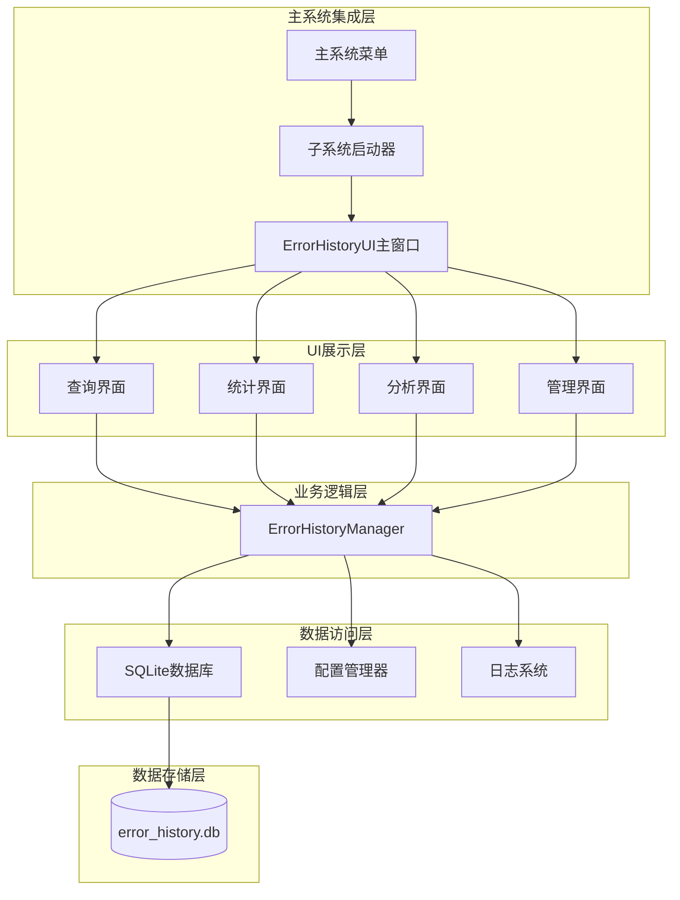

# 错误历史持久化子系统设计文档

**文档版本**: V1.0
**创建时间**: 2025-10-20 12:06:35
**文档类型**: 子系统设计文档
**子系统名称**: 错误历史持久化子系统
**关联任务**: LAD-IMPL-011
**文档位置**: docs/错误历史持久化子系统-设计文档.md

---

## 📋 错误历史持久化子系统设计文档

### 1. **子系统概述**

#### 1.1 基本信息
- **子系统名称**: 错误历史持久化子系统
- **英文名称**: Error History Persistence Subsystem
- **版本号**: 1.0.0
- **所属系统**: 本地Markdown文件渲染器系统
- **子系统类型**: 数据持久化与分析子系统

#### 1.2 设计目标
1. **数据持久化**: 将错误信息从内存存储迁移到数据库持久化存储
2. **数据分析**: 提供错误趋势分析、统计报表等数据分析功能
3. **用户界面**: 提供直观的数据检索和分析操作界面
4. **系统集成**: 无缝集成到主系统，可通过菜单调用

#### 1.3 核心功能
- ✅ 错误数据持久化存储
- ✅ 错误数据检索和查询
- ✅ 错误统计和分析
- ✅ 数据可视化展示
- ✅ 自动数据清理
- ✅ 配置管理和热重载
- ✅ 与主系统无缝集成

### 2. **系统架构设计**

#### 2.1 整体架构


#### 2.2 组件说明

##### 2.2.1 ErrorHistoryManager（核心管理器）
- **职责**: 数据库操作、数据迁移、查询统计
- **接口**: CRUD操作、统计分析、数据清理
- **依赖**: SQLite3、ConfigManager

##### 2.2.2 ErrorHistoryUI（用户界面）
- **职责**: 数据展示、用户交互、操作响应
- **组件**: 主窗口、查询面板、统计图表、分析视图
- **技术**: PyQt5界面框架

##### 2.2.3 配置管理
- **职责**: 子系统配置管理、热重载支持
- **配置项**: 数据库路径、清理策略、界面设置

##### 2.2.4 数据迁移器
- **职责**: 从内存数据迁移到数据库
- **策略**: 渐进式迁移、数据完整性保证

### 3. **数据库设计**

#### 3.1 数据库架构
```sql
-- 错误历史数据库
-- 文件位置: data/error_history.db

-- 主错误表
CREATE TABLE error_history (
    id INTEGER PRIMARY KEY AUTOINCREMENT,
    error_id TEXT NOT NULL UNIQUE,           -- 错误唯一标识
    error_type TEXT NOT NULL,                -- 错误类型
    error_message TEXT NOT NULL,             -- 错误消息
    severity TEXT NOT NULL,                  -- 严重程度 (LOW/MEDIUM/HIGH/CRITICAL)
    category TEXT NOT NULL,                  -- 错误分类
    module TEXT,                             -- 模块名
    function TEXT,                           -- 函数名
    line_number INTEGER,                     -- 行号
    stack_trace TEXT,                        -- 堆栈跟踪
    context TEXT,                            -- 上下文信息(JSON)
    user_context TEXT,                       -- 用户上下文(JSON)
    system_context TEXT,                     -- 系统上下文(JSON)
    created_at TIMESTAMP DEFAULT CURRENT_TIMESTAMP,
    resolved BOOLEAN DEFAULT 0,              -- 是否已解决
    resolved_at TIMESTAMP,                   -- 解决时间
    resolution_method TEXT,                  -- 解决方法
    resolution_time REAL,                    -- 解决耗时(秒)
    retry_count INTEGER DEFAULT 0,           -- 重试次数
    max_retries INTEGER DEFAULT 3,           -- 最大重试次数
    tags TEXT,                               -- 标签(JSON数组)
    metadata TEXT                            -- 元数据(JSON)
);

-- 错误统计表 (按日统计)
CREATE TABLE error_statistics_daily (
    id INTEGER PRIMARY KEY AUTOINCREMENT,
    date DATE NOT NULL UNIQUE,               -- 统计日期
    total_errors INTEGER DEFAULT 0,          -- 总错误数
    errors_by_severity TEXT,                 -- 按严重程度统计(JSON)
    errors_by_category TEXT,                 -- 按分类统计(JSON)
    errors_by_module TEXT,                   -- 按模块统计(JSON)
    resolved_errors INTEGER DEFAULT 0,       -- 已解决错误数
    unresolved_errors INTEGER DEFAULT 0,     -- 未解决错误数
    avg_resolution_time REAL,                -- 平均解决时间
    error_rate_per_hour REAL,                -- 每小时错误率
    created_at TIMESTAMP DEFAULT CURRENT_TIMESTAMP
);

-- 系统配置表
CREATE TABLE system_config (
    id INTEGER PRIMARY KEY AUTOINCREMENT,
    config_key TEXT NOT NULL UNIQUE,
    config_value TEXT,
    config_type TEXT,                        -- 配置类型
    description TEXT,                        -- 配置描述
    updated_at TIMESTAMP DEFAULT CURRENT_TIMESTAMP
);

-- 索引优化
CREATE INDEX idx_error_history_created_at ON error_history(created_at);
CREATE INDEX idx_error_history_severity ON error_history(severity);
CREATE INDEX idx_error_history_category ON error_history(category);
CREATE INDEX idx_error_history_module ON error_history(module);
CREATE INDEX idx_error_history_resolved ON error_history(resolved);
CREATE INDEX idx_error_statistics_daily_date ON error_statistics_daily(date);
```

#### 3.2 数据模型

##### 3.2.1 ErrorRecord（错误记录）
```python
@dataclass
class ErrorRecord:
    id: Optional[int] = None
    error_id: str = ""
    error_type: str = ""
    error_message: str = ""
    severity: ErrorSeverity = ErrorSeverity.LOW
    category: ErrorCategory = ErrorCategory.UNKNOWN
    module: Optional[str] = None
    function: Optional[str] = None
    line_number: Optional[int] = None
    stack_trace: Optional[str] = None
    context: Optional[Dict[str, Any]] = None
    user_context: Optional[Dict[str, Any]] = None
    system_context: Optional[Dict[str, Any]] = None
    created_at: Optional[datetime] = None
    resolved: bool = False
    resolved_at: Optional[datetime] = None
    resolution_method: Optional[str] = None
    resolution_time: Optional[float] = None
    retry_count: int = 0
    max_retries: int = 3
    tags: List[str] = None
    metadata: Optional[Dict[str, Any]] = None
```

##### 3.2.2 DailyStatistics（日统计）
```python
@dataclass
class DailyStatistics:
    date: date
    total_errors: int = 0
    errors_by_severity: Dict[str, int] = None
    errors_by_category: Dict[str, int] = None
    errors_by_module: Dict[str, int] = None
    resolved_errors: int = 0
    unresolved_errors: int = 0
    avg_resolution_time: Optional[float] = None
    error_rate_per_hour: Optional[float] = None
```

### 4. **ErrorHistoryManager设计**

#### 4.1 类结构
```python
class ErrorHistoryManager:
    def __init__(self, db_path: str = None, config_manager: ConfigManager = None):
        """初始化错误历史管理器"""
        self.db_path = db_path or self._get_default_db_path()
        self.config_manager = config_manager or ConfigManager()
        self._init_database()
        self._setup_config_listeners()

    # 数据库操作方法
    def save_error(self, error_record: ErrorRecord) -> bool: ...
    def get_error(self, error_id: str) -> Optional[ErrorRecord]: ...
    def update_error(self, error_record: ErrorRecord) -> bool: ...
    def delete_error(self, error_id: str) -> bool: ...

    # 查询方法
    def query_errors(self, filters: Dict[str, Any], limit: int = 100) -> List[ErrorRecord]: ...
    def get_recent_errors(self, limit: int = 50) -> List[ErrorRecord]: ...
    def get_errors_by_date_range(self, start_date: date, end_date: date) -> List[ErrorRecord]: ...

    # 统计方法
    def get_statistics(self, date_range: Tuple[date, date] = None) -> Dict[str, Any]: ...
    def get_daily_statistics(self, target_date: date = None) -> DailyStatistics: ...
    def get_trend_analysis(self, days: int = 30) -> Dict[str, Any]: ...

    # 管理方法
    def cleanup_old_errors(self, days: int = 30) -> int: ...
    def optimize_database(self) -> bool: ...
    def backup_database(self, backup_path: str) -> bool: ...
    def export_data(self, file_path: str, format: str = 'json') -> bool: ...

    # 配置相关
    def _load_config(self) -> None: ...
    def _on_config_changed(self, config_path: str) -> None: ...

    # 私有方法
    def _init_database(self) -> None: ...
    def _create_tables(self) -> None: ...
    def _migrate_data_from_memory(self) -> None: ...
```

#### 4.2 核心方法实现

##### 4.2.1 保存错误
```python
def save_error(self, error_record: ErrorRecord) -> bool:
    """保存错误记录到数据库"""
    try:
        with sqlite3.connect(self.db_path) as conn:
            cursor = conn.cursor()

            # 准备数据
            data = {
                'error_id': error_record.error_id,
                'error_type': error_record.error_type,
                'error_message': error_record.error_message,
                'severity': error_record.severity.value,
                'category': error_record.category.value,
                'module': error_record.module,
                'function': error_record.function,
                'line_number': error_record.line_number,
                'stack_trace': error_record.stack_trace,
                'context': json.dumps(error_record.context) if error_record.context else None,
                'user_context': json.dumps(error_record.user_context) if error_record.user_context else None,
                'system_context': json.dumps(error_record.system_context) if error_record.system_context else None,
                'resolved': error_record.resolved,
                'resolved_at': error_record.resolved_at.isoformat() if error_record.resolved_at else None,
                'resolution_method': error_record.resolution_method,
                'resolution_time': error_record.resolution_time,
                'retry_count': error_record.retry_count,
                'max_retries': error_record.max_retries,
                'tags': json.dumps(error_record.tags) if error_record.tags else None,
                'metadata': json.dumps(error_record.metadata) if error_record.metadata else None
            }

            # 插入或更新
            cursor.execute('''
                INSERT OR REPLACE INTO error_history
                (error_id, error_type, error_message, severity, category, module,
                 function, line_number, stack_trace, context, user_context, system_context,
                 resolved, resolved_at, resolution_method, resolution_time,
                 retry_count, max_retries, tags, metadata)
                VALUES (:error_id, :error_type, :error_message, :severity, :category, :module,
                        :function, :line_number, :stack_trace, :context, :user_context, :system_context,
                        :resolved, :resolved_at, :resolution_method, :resolution_time,
                        :retry_count, :max_retries, :tags, :metadata)
            ''', data)

            conn.commit()
            return True

    except Exception as e:
        logger.error(f"保存错误记录失败: {e}")
        return False
```

##### 4.2.2 查询错误
```python
def query_errors(self, filters: Dict[str, Any], limit: int = 100) -> List[ErrorRecord]:
    """根据条件查询错误记录"""
    try:
        with sqlite3.connect(self.db_path) as conn:
            conn.row_factory = sqlite3.Row
            cursor = conn.cursor()

            # 构建查询条件
            where_clauses = []
            params = {}

            if 'severity' in filters:
                where_clauses.append("severity = :severity")
                params['severity'] = filters['severity'].value

            if 'category' in filters:
                where_clauses.append("category = :category")
                params['category'] = filters['category'].value

            if 'module' in filters:
                where_clauses.append("module = :module")
                params['module'] = filters['module']

            if 'resolved' in filters:
                where_clauses.append("resolved = :resolved")
                params['resolved'] = filters['resolved']

            if 'start_date' in filters:
                where_clauses.append("date(created_at) >= :start_date")
                params['start_date'] = filters['start_date'].isoformat()

            if 'end_date' in filters:
                where_clauses.append("date(created_at) <= :end_date")
                params['end_date'] = filters['end_date'].isoformat()

            # 构建查询语句
            where_clause = " AND ".join(where_clauses) if where_clauses else "1=1"
            query = f"""
                SELECT * FROM error_history
                WHERE {where_clause}
                ORDER BY created_at DESC
                LIMIT :limit
            """
            params['limit'] = limit

            cursor.execute(query, params)
            rows = cursor.fetchall()

            # 转换为ErrorRecord对象
            errors = []
            for row in rows:
                error = ErrorRecord(
                    id=row['id'],
                    error_id=row['error_id'],
                    error_type=row['error_type'],
                    error_message=row['error_message'],
                    severity=ErrorSeverity(row['severity']),
                    category=ErrorCategory(row['category']),
                    module=row['module'],
                    function=row['function'],
                    line_number=row['line_number'],
                    stack_trace=row['stack_trace'],
                    context=json.loads(row['context']) if row['context'] else None,
                    user_context=json.loads(row['user_context']) if row['user_context'] else None,
                    system_context=json.loads(row['system_context']) if row['system_context'] else None,
                    created_at=datetime.fromisoformat(row['created_at']),
                    resolved=bool(row['resolved']),
                    resolved_at=datetime.fromisoformat(row['resolved_at']) if row['resolved_at'] else None,
                    resolution_method=row['resolution_method'],
                    resolution_time=row['resolution_time'],
                    retry_count=row['retry_count'],
                    max_retries=row['max_retries'],
                    tags=json.loads(row['tags']) if row['tags'] else None,
                    metadata=json.loads(row['metadata']) if row['metadata'] else None
                )
                errors.append(error)

            return errors

    except Exception as e:
        logger.error(f"查询错误记录失败: {e}")
        return []
```

##### 4.2.3 统计分析
```python
def get_statistics(self, date_range: Tuple[date, date] = None) -> Dict[str, Any]:
    """获取错误统计信息"""
    try:
        with sqlite3.connect(self.db_path) as conn:
            cursor = conn.cursor()

            # 设置日期范围
            if date_range:
                start_date, end_date = date_range
                date_condition = "AND date(created_at) BETWEEN ? AND ?"
                date_params = [start_date.isoformat(), end_date.isoformat()]
            else:
                date_condition = ""
                date_params = []

            # 基本统计
            cursor.execute(f'''
                SELECT
                    COUNT(*) as total_errors,
                    SUM(CASE WHEN resolved = 1 THEN 1 ELSE 0 END) as resolved_errors,
                    SUM(CASE WHEN resolved = 0 THEN 1 ELSE 0 END) as unresolved_errors,
                    AVG(CASE WHEN resolved = 1 THEN resolution_time ELSE NULL END) as avg_resolution_time
                FROM error_history
                WHERE 1=1 {date_condition}
            ''', date_params)

            basic_stats = cursor.fetchone()

            # 按严重程度统计
            cursor.execute(f'''
                SELECT severity, COUNT(*) as count
                FROM error_history
                WHERE 1=1 {date_condition}
                GROUP BY severity
                ORDER BY count DESC
            ''', date_params)

            severity_stats = {row[0]: row[1] for row in cursor.fetchall()}

            # 按分类统计
            cursor.execute(f'''
                SELECT category, COUNT(*) as count
                FROM error_history
                WHERE 1=1 {date_condition}
                GROUP BY category
                ORDER BY count DESC
            ''', date_params)

            category_stats = {row[0]: row[1] for row in cursor.fetchall()}

            # 按模块统计
            cursor.execute(f'''
                SELECT module, COUNT(*) as count
                FROM error_history
                WHERE module IS NOT NULL AND module != ''
                AND 1=1 {date_condition}
                GROUP BY module
                ORDER BY count DESC
                LIMIT 20
            ''', date_params)

            module_stats = {row[0]: row[1] for row in cursor.fetchall()}

            # 计算错误率
            if date_range:
                days = (end_date - start_date).days + 1
                error_rate_per_day = basic_stats[0] / days if days > 0 else 0
                error_rate_per_hour = error_rate_per_day / 24
            else:
                # 计算最近30天的错误率
                cursor.execute('''
                    SELECT COUNT(*) as count
                    FROM error_history
                    WHERE created_at >= datetime('now', '-30 days')
                ''')
                recent_count = cursor.fetchone()[0]
                error_rate_per_hour = recent_count / (30 * 24)

            return {
                'total_errors': basic_stats[0],
                'resolved_errors': basic_stats[1],
                'unresolved_errors': basic_stats[2],
                'avg_resolution_time': basic_stats[3],
                'error_rate_per_hour': error_rate_per_hour,
                'errors_by_severity': severity_stats,
                'errors_by_category': category_stats,
                'errors_by_module': module_stats,
                'date_range': date_range
            }

    except Exception as e:
        logger.error(f"获取统计信息失败: {e}")
        return {}
```

### 5. **用户界面设计**

#### 5.1 主窗口布局
```
┌─────────────────────────────────────────────────────────┐
│ 错误历史持久化子系统 v1.0.0                    [_][□][X] │
├─────────────────────────────────────────────────────────┤
│ ┌─ 工具栏 ──────────────────────┐ ┌─ 搜索栏 ──────────┐ │
│ │ [查询] [统计] [分析] [管理] [导出] │ │ 日期范围: [    ] │ │
│ └────────────────────────────────┘ └───────────────────┘ │
├─────────────────────────────────────────────────────────┤
│ ┌─ 导航面板 ─┐ ┌─ 主内容区域 ──────────────────────┐ │
│ │ • 查询     │ │                                     │ │
│ │ • 统计     │ │          [选项卡式内容显示]         │ │
│ │ • 分析     │ │                                     │ │
│ │ • 管理     │ └─────────────────────────────────────┘ │
│ └────────────┘                                         │
├─────────────────────────────────────────────────────────┤
│ ┌─ 状态栏 ────────────────────────────────────────────┐ │
│ │ 总错误数: 1234 | 已解决: 89% | 平均解决时间: 15.3分钟 │ │
│ └──────────────────────────────────────────────────────┘ │
└─────────────────────────────────────────────────────────┘
```

#### 5.2 查询界面设计
- **过滤条件面板**: 日期范围、严重程度、分类、模块、解决状态
- **结果列表**: 错误ID、时间、类型、消息、状态
- **详情面板**: 选中错误的完整信息展示
- **操作按钮**: 查看详情、标记解决、导出选中项

#### 5.3 统计界面设计
- **概览卡片**: 总错误数、解决率、平均解决时间
- **趋势图表**: 按日/周/月的错误数量趋势
- **分布图表**: 按严重程度、分类、模块的饼图/柱状图
- **热力图**: 错误发生的时间分布

#### 5.4 分析界面设计
- **模式识别**: 识别重复错误模式
- **根本原因分析**: 基于错误堆栈的分析
- **影响评估**: 评估错误对系统的影响程度
- **改进建议**: 基于历史数据提供改进建议

#### 5.5 管理界面设计
- **配置管理**: 数据库路径、清理策略、备份设置
- **数据维护**: 手动清理、优化数据库、数据导出
- **监控设置**: 告警阈值、通知配置
- **系统信息**: 数据库状态、存储统计

### 6. **配置设计**

#### 6.1 配置文件结构
```json
// config/features/error_history.json
{
  "version": "1.0",
  "enabled": true,
  "database": {
    "path": "data/error_history.db",
    "max_connections": 5,
    "timeout_seconds": 30,
    "backup_enabled": true,
    "backup_interval_hours": 24
  },
  "retention": {
    "days": 90,
    "auto_cleanup": true,
    "cleanup_schedule": "0 2 * * *",
    "compression_enabled": false
  },
  "ui": {
    "theme": "system",
    "language": "zh-CN",
    "page_size": 50,
    "auto_refresh_seconds": 30,
    "chart_colors": ["#FF6384", "#36A2EB", "#FFCE56", "#4BC0C0"]
  },
  "monitoring": {
    "alerts_enabled": true,
    "error_rate_threshold": 10,
    "unresolved_threshold": 50,
    "alert_channels": ["log", "notification"]
  },
  "export": {
    "default_format": "json",
    "supported_formats": ["json", "csv", "xlsx", "pdf"],
    "max_export_rows": 10000
  }
}
```

#### 6.2 配置热重载
```python
class ErrorHistoryConfig:
    def __init__(self, config_manager: ConfigManager):
        self.config_manager = config_manager
        self._load_config()
        self.config_manager.add_listener("features.error_history", self._on_config_changed)

    def _load_config(self):
        """加载错误历史配置"""
        config = self.config_manager.get_config("error_history", {}, "features")

        self.enabled = config.get("enabled", True)
        self.database_path = config.get("database", {}).get("path", "data/error_history.db")
        self.retention_days = config.get("retention", {}).get("days", 90)
        self.auto_cleanup = config.get("retention", {}).get("auto_cleanup", True)

        # UI配置
        ui_config = config.get("ui", {})
        self.theme = ui_config.get("theme", "system")
        self.language = ui_config.get("language", "zh-CN")
        self.page_size = ui_config.get("page_size", 50)

        # 监控配置
        monitoring_config = config.get("monitoring", {})
        self.alerts_enabled = monitoring_config.get("alerts_enabled", True)
        self.error_rate_threshold = monitoring_config.get("error_rate_threshold", 10)

    def _on_config_changed(self, config_path: str):
        """配置变更处理"""
        if "error_history" in config_path:
            old_config = self.__dict__.copy()
            self._load_config()

            # 检查需要重启的配置变更
            restart_required = (
                old_config.get('database_path') != self.database_path or
                old_config.get('enabled') != self.enabled
            )

            if restart_required:
                logger.info("错误历史配置重大变更，建议重启子系统")
            else:
                logger.info("错误历史配置已更新")
```

### 7. **与主系统集成**

#### 7.1 菜单集成
```python
# 在主系统菜单中添加错误历史选项
def add_error_history_menu(main_window):
    """添加错误历史子系统到主菜单"""

    # 创建错误历史菜单
    error_history_menu = main_window.menuBar().addMenu("错误历史(&E)")

    # 查询错误历史
    query_action = QAction("查询错误历史(&Q)", main_window)
    query_action.setShortcut("Ctrl+Shift+E")
    query_action.triggered.connect(lambda: open_error_history_ui("query"))
    error_history_menu.addAction(query_action)

    # 错误统计
    stats_action = QAction("错误统计(&S)", main_window)
    stats_action.triggered.connect(lambda: open_error_history_ui("statistics"))
    error_history_menu.addAction(stats_action)

    # 错误分析
    analysis_action = QAction("错误分析(&A)", main_window)
    analysis_action.triggered.connect(lambda: open_error_history_ui("analysis"))
    error_history_menu.addAction(analysis_action)

    error_history_menu.addSeparator()

    # 系统管理
    manage_action = QAction("系统管理(&M)", main_window)
    manage_action.triggered.connect(lambda: open_error_history_ui("management"))
    error_history_menu.addAction(manage_action)

def open_error_history_ui(mode: str = "query"):
    """打开错误历史UI"""
    try:
        from error_history.ui.main_window import ErrorHistoryMainWindow

        # 创建UI窗口
        ui_window = ErrorHistoryMainWindow(mode=mode)

        # 设置为独立窗口
        ui_window.setWindowModality(Qt.ApplicationModal)
        ui_window.show()

        # 连接关闭信号
        ui_window.destroyed.connect(lambda: logger.info("错误历史UI窗口已关闭"))

    except Exception as e:
        logger.error(f"打开错误历史UI失败: {e}")
        QMessageBox.critical(None, "错误", f"无法打开错误历史界面:\n{str(e)}")
```

#### 7.2 状态同步
```python
class ErrorHistoryIntegration:
    """错误历史与主系统的集成管理器"""

    def __init__(self, main_app, error_history_manager):
        self.main_app = main_app
        self.error_history_manager = error_history_manager
        self._setup_integration()

    def _setup_integration(self):
        """设置集成点"""

        # 1. 错误处理器集成
        if hasattr(self.main_app, 'error_handler'):
            original_handle_error = self.main_app.error_handler.handle_error

            def enhanced_handle_error(exception, context=None):
                # 先调用原始错误处理
                error_info = original_handle_error(exception, context)

                # 然后保存到错误历史数据库
                if error_info:
                    try:
                        error_record = self._convert_to_error_record(error_info)
                        self.error_history_manager.save_error(error_record)
                    except Exception as e:
                        logger.warning(f"保存错误到历史数据库失败: {e}")

                return error_info

            self.main_app.error_handler.handle_error = enhanced_handle_error

        # 2. 状态栏集成
        if hasattr(self.main_app, 'status_bar'):
            self._add_status_bar_integration()

        # 3. 配置同步
        if hasattr(self.main_app, 'config_manager'):
            self._setup_config_sync()

    def _convert_to_error_record(self, error_info) -> ErrorRecord:
        """将ErrorInfo转换为ErrorRecord"""
        return ErrorRecord(
            error_id=error_info.error_id,
            error_type=error_info.error_type,
            error_message=error_info.error_message,
            severity=error_info.severity,
            category=error_info.category,
            context={
                'module': error_info.context.module if error_info.context else None,
                'function': error_info.context.function if error_info.context else None,
                'line_number': error_info.context.line_number if error_info.context else None,
                'stack_trace': error_info.context.stack_trace if error_info.context else None,
            } if error_info.context else None,
            user_context=error_info.context.user_context if error_info.context else None,
            system_context=error_info.context.system_context if error_info.context else None,
            resolved=error_info.resolved,
            resolution_method=getattr(error_info, 'resolution_method', None),
            retry_count=getattr(error_info, 'retry_count', 0),
            max_retries=getattr(error_info, 'max_retries', 3)
        )

    def _add_status_bar_integration(self):
        """添加状态栏错误统计显示"""
        try:
            # 获取当前错误统计
            stats = self.error_history_manager.get_statistics()

            if stats:
                status_text = (
                    f"错误统计: 总数{stats.get('total_errors', 0)} | "
                    f"未解决{stats.get('unresolved_errors', 0)} | "
                    f"解决率{stats.get('resolved_errors', 0)/max(stats.get('total_errors', 1), 1)*100:.1f}%"
                )

                # 更新状态栏
                if hasattr(self.main_app.status_bar, 'showMessage'):
                    self.main_app.status_bar.showMessage(status_text, 10000)  # 显示10秒

        except Exception as e:
            logger.warning(f"更新状态栏错误统计失败: {e}")

    def _setup_config_sync(self):
        """设置配置同步"""
        # 监听主系统配置变更
        self.main_app.config_manager.add_listener(
            "error_history",
            self._on_main_config_changed
        )

    def _on_main_config_changed(self, config_path: str):
        """主系统配置变更处理"""
        if "error_history" in config_path:
            logger.info("主系统错误历史配置已变更，同步到子系统")
            # 通知错误历史管理器重新加载配置
            if hasattr(self.error_history_manager, '_load_config'):
                self.error_history_manager._load_config()
```

### 8. **部署和运行**

#### 8.1 目录结构
```
local_markdown_viewer/
├── error_history/                    # 子系统根目录
│   ├── __init__.py                  # 子系统初始化
│   ├── core/                        # 核心模块
│   │   ├── __init__.py
│   │   ├── manager.py               # ErrorHistoryManager
│   │   ├── models.py                # 数据模型
│   │   └── migration.py             # 数据迁移
│   ├── ui/                          # 用户界面
│   │   ├── __init__.py
│   │   ├── main_window.py           # 主窗口
│   │   ├── query_panel.py           # 查询面板
│   │   ├── stats_panel.py           # 统计面板
│   │   ├── analysis_panel.py        # 分析面板
│   │   └── management_panel.py      # 管理面板
│   ├── config/                      # 配置管理
│   │   ├── __init__.py
│   │   └── config_manager.py        # 子系统配置管理
│   ├── utils/                       # 工具函数
│   │   ├── __init__.py
│   │   ├── exporters.py             # 数据导出器
│   │   └── formatters.py            # 数据格式化器
│   └── integration/                 # 主系统集成
│       ├── __init__.py
│       └── main_integration.py      # 主系统集成代码
├── data/                            # 数据目录
│   └── error_history.db             # 错误历史数据库
└── docs/                            # 文档
    └── 错误历史持久化子系统-设计文档.md
```

#### 8.2 启动流程
1. **主系统启动**: 加载错误历史子系统模块
2. **配置初始化**: 读取子系统配置
3. **数据库初始化**: 创建/连接数据库，执行迁移
4. **UI注册**: 注册菜单项和快捷键
5. **集成设置**: 设置与主系统的集成点
6. **后台任务**: 启动清理和监控任务

#### 8.3 依赖管理
```txt
# requirements-error-history.txt
PyQt5>=5.15.0          # UI框架
matplotlib>=3.5.0      # 图表绘制
pandas>=1.5.0          # 数据分析
openpyxl>=3.0.0        # Excel导出
reportlab>=3.6.0       # PDF生成
apscheduler>=3.9.0     # 定时任务
```

### 9. **测试和验收**

#### 9.1 测试策略
- **单元测试**: 核心功能测试
- **集成测试**: 与主系统集成测试
- **UI测试**: 用户界面功能测试
- **性能测试**: 大数据量下的性能表现
- **压力测试**: 高并发错误记录场景

#### 9.2 验收标准
- ✅ 数据库操作正常
- ✅ UI界面响应流畅
- ✅ 数据查询准确快速
- ✅ 统计分析结果正确
- ✅ 与主系统集成无缝
- ✅ 配置热重载生效
- ✅ 数据导出功能完整
- ✅ 自动清理机制有效

### 10. **维护和扩展**

#### 10.1 监控和告警
- 数据库连接状态监控
- 存储空间使用率监控
- 错误记录性能监控
- 数据完整性检查

#### 10.2 备份和恢复
- 自动备份机制
- 手动备份功能
- 数据恢复流程
- 灾难恢复方案

#### 10.3 性能优化
- 数据库索引优化
- 查询性能调优
- 缓存策略实现
- 异步处理机制

---

**设计完成时间**: 2025-10-20 12:06:35
**设计人员**: LAD AI Assistant
**审核状态**: 待审核
**版本控制**: Git分支 error-history-subsystem-v1.0
