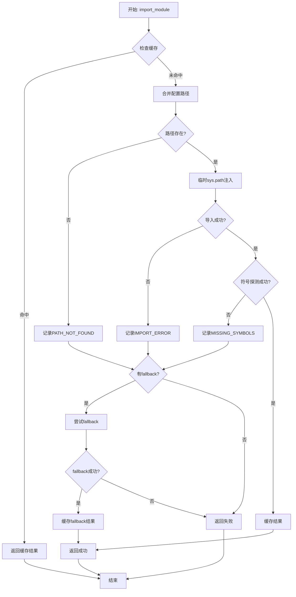

# 混合架构模块导入方案设计

## 1. 设计目标
- 在不破坏现有功能与向后兼容的前提下，为本地 Markdown 渲染程序引入“动态导入 + 统一路径解析”的混合方案。
- 提供清晰的组件边界、配置契约、错误回退与日志可观测规范，确保冷启动/热切换的稳定与可控成本。
- 保持现有 `FileResolver` 行为不变，增量引入 `DynamicModuleImporter` 与 `HybridMarkdownRenderer`（或在现有渲染器上以可选分支实现）。

## 2. 架构与组件
### 2.1 DynamicModuleImporter（职责、接口、流程）
- 职责：
  - 基于配置按优先级动态导入外部模块（如 `markdown_processor`），并在失败时退回 fallback（如标准 `markdown` 库）。
  - 提供导入结果缓存、临时 `sys.path` 上下文管理、结构化错误、可观测状态查询。
- 关键能力：
  - 多路径：仅读取 `external_modules.<name>.module_path`（取消 markdown 段后备路径）。
  - 缓存：成功导入后缓存模块与关键函数，避免重复解析；提供 `clear_cache()`。
  - 可观测：`get_import_status()` 返回 cached_modules、configured_paths、last_error。
- 建议接口：
  - `import_module(module_name: str, fallback_modules: list[str] = None) -> dict`
  - `clear_cache() -> None`
  - `get_import_status() -> dict`
- 成功返回示例：
```json
{
  "success": true,
  "module": "markdown_processor",
  "functions": {
    "render_markdown_with_zoom": "<callable>",
    "render_markdown_to_html": "<callable>"
  },
  "path": "D:/lad/lad_markdown_viewer"
}
```
- 失败返回示例：
```json
{
  "success": false,
  "error_code": "IMPORT_ERROR",
  "message": "No module named 'markdown_processor'",
  "attempted_paths": ["D:/lad/lad_markdown_viewer"],
  "used_fallback": true
}
```
- 流程要点：
  1) 合并配置来源，解析路径（支持相对→绝对）。
  2) 进入临时 `sys.path` 上下文，尝试导入与符号探测。
  3) 失败则遍历 fallback；成功则缓存并返回；最终失败结构化返回。

- 流程图：


### 2.2 HybridMarkdownRenderer（能力检测、优先级、降级）
- 初始化阶段：
  - 读取 `markdown.use_dynamic_import`（默认 true）。
  - 若为 true，调用 `DynamicModuleImporter` 尝试 `markdown_processor`，并探测 `render_markdown_with_zoom`、`render_markdown_to_html`。
  - 记录“可用性”与“使用路径/fallback”到日志。
- 渲染优先级：
  - 1) `markdown_processor`（若可用）；
  - 2) 标准 `markdown` 库；
  - 3) 纯文本降级（受 `markdown.fallback_enabled` 控制）。
- 选项传递：保持现有 `enable_zoom`、`enable_syntax_highlight`、`max_content_length`、`cache_enabled` 等不变；新增 `use_dynamic_import` 开关。
- 可观测性：输出渲染器选择、耗时、降级原因。

### 2.3 与 FileResolver 的交互契约
- FileResolver 仍只负责文件存在性、大小、编码、类型识别与内容读取，不参与模块导入。
- Hybrid 渲染器通过 `resolve_file_path(..., read_content=True)` 获取内容与编码信息后再进行渲染。

## 3. 配置方案
- external_modules 段（以 `markdown_processor` 为例）：
```json
{
  "external_modules": {
    "markdown_processor": {
      "module_path": "../../../lad_markdown_viewer",
      "enabled": true,
      "version": "1.0.0",
      "description": "高级Markdown渲染处理器",
      "priority": 1
    }
  }
}
```
- markdown 段：
```json
{
  "markdown": {
    "use_dynamic_import": true,
    "fallback_enabled": true,
    "cache_enabled": true,
    "max_content_length": 5242880
  }
}
```
- 校验与错误提示：
  - 当 `external_modules.markdown_processor.enabled == true` 时，`module_path` 必填且需存在。
  - 若路径无效或导入缺符号，记录 `MISSING_SYMBOLS/IMPORT_ERROR/PATH_NOT_FOUND` 并回退。
  - 对 `max_content_length` 设置合理上下限（如 64KB–32MB），越界回退至默认并告警。

- 默认值与上下限简表：
| 配置段 | 字段 | 默认值 | 下限 | 上限 | 说明 |
|--------|------|--------|------|------|------|
| `external_modules.markdown_processor` | `enabled` | `false` | - | - | 是否启用动态导入 |
| | `module_path` | `""` | - | - | 模块路径（相对/绝对） |
| | `version` | `"1.0.0"` | - | - | 版本标识 |
| | `description` | `""` | - | - | 描述信息 |
| | `priority` | `1` | `1` | `10` | 优先级（数字越小越高） |
| `markdown` | `use_dynamic_import` | `true` | - | - | 是否使用动态导入 |
| | `fallback_enabled` | `true` | - | - | 是否启用降级 |
| | `cache_enabled` | `true` | - | - | 是否启用缓存 |
| | `max_content_length` | `5242880` | `65536` | `33554432` | 最大内容长度（字节） |

## 4. 错误处理与回退
- 回退顺序：动态导入 → 标准 markdown → 文本降级。
- 关键日志（示例键）：
  - `module_name`、`resolved_path`、`attempted_paths`、`used_fallback`、`elapsed_ms`、`error_code`、`renderer_choice`。
- 典型失败场景：
  - 路径不存在（PATH_NOT_FOUND）→ 记录后继续 fallback。
  - 模块导入失败（IMPORT_ERROR）→ 记录异常消息与堆栈摘要。
  - 缺少必要函数（MISSING_SYMBOLS）→ 记录缺失清单并回退。

## 5. 向后兼容性
- 不修改 `FileResolver` 行为与对外接口。
- 现有 `MarkdownRenderer` 可保持不变；也可通过新增 `HybridMarkdownRenderer` 并在 UI/调用层注入切换，不影响既有使用方。
- 默认值保证：即使动态导入失败，仍有稳定渲染路径（标准 markdown 或文本）。

## 6. 实施计划
- 任务拆分：
  1) 新增 `DynamicModuleImporter` 模块（独立文件，含上下文导入、缓存、状态查询）。
  2) 新增 `HybridMarkdownRenderer` 或在现有渲染器中以配置开关接入动态导入分支。
  3) 日志与错误码固化：统一键名与错误码常量；在关键路径埋点。
  4) 配置校验：在初始化时做轻量校验与告警；不阻塞应用。
- 文件改动清单（设计阶段声明，实施阶段具体化）：
  - `core/dynamic_module_importer.py`（新增）
   - `core/hybrid_markdown_renderer.py` 或修改 `core/markdown_renderer.py`（可选其一）
  - 可选更新 `utils/config_manager.py`（仅增加安全读取与默认值，不破坏既有 API）
- 风险与缓解：
  - 冷启动/热切换成本：仅首轮探测导入；提供 `clear_cache()`；切换延迟至下一次渲染调用生效。
  - sys.path 污染：使用上下文管理器立即恢复；限制受信路径前缀。
  - 依赖缺失：结构化错误 + 回退；在 About/状态栏给出人类可读提示。

---
实施关键数据摘要：
- API：`import_module(name, fallbacks) -> { success, module/functions, path, used_fallback, error }`
- 必要函数：`render_markdown_with_zoom`、`render_markdown_to_html`
- 配置键：`external_modules.markdown_processor.*`、`markdown.use_dynamic_import|fallback_enabled|cache_enabled|max_content_length`
- 日志键：`module_name`、`resolved_path`、`attempted_paths`、`used_fallback`、`elapsed_ms`、`renderer_choice`、`error_code`